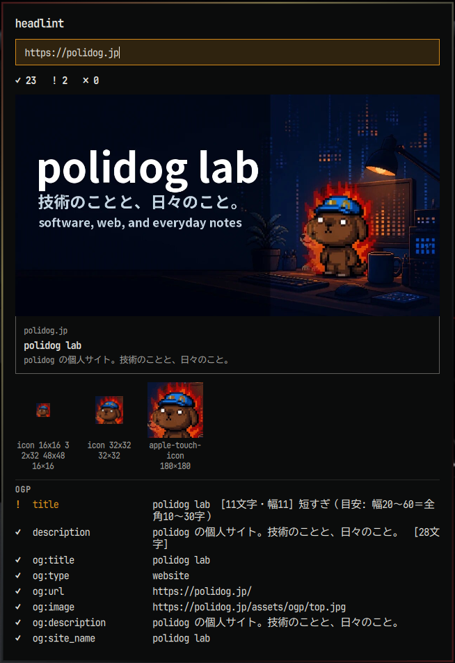

# omarchy-headlint



Omarchy のバーから URL を入れて、[headlint](https://github.com/polidog/headlint) で `<head>`（OGP / title / favicon / canonical / robots）を解析するシェルプラグイン。og:image / twitter:image は SNS カード風に、favicon は実寸（上限 64px）でその場に描画します。

## 必要なもの

- `curl`（画像の取得に使用）

```bash
cargo install --git https://github.com/polidog/headlint
```

## インストール

```bash
omarchy plugin add https://github.com/polidog/omarchy-headlint
omarchy plugin enable polidog.headlint --section right
```

## 使い方

| 操作 | 動作 |
|------|------|
| アイコン左クリック | パネルを開く（URL 欄にフォーカス） |
| URL 入力して Enter | 解析（`https://` は省略可） |
| アイコン右クリック | 直前の URL を再解析 |
| カードをクリック | ページをブラウザで開く |
| Esc | 閉じる |

✗ が 1 つでもあるとアイコンが強調色になります。

キーバインドや スクリプトから:

```bash
omarchy-shell polidog.headlint analyze https://polidog.jp
# クリップボードの URL を解析
o.bind("SUPER SHIFT, S", "exec", "omarchy-shell polidog.headlint analyze \"$(wl-paste)\"")
```

## テスト

```bash
node test.js
```

## License

MIT
